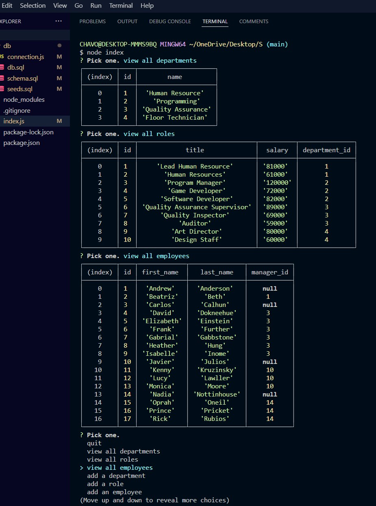

# Employee Tracker MySQL, Inc,

## Description
Control and manipulate a collection of data to better manage your employees information.
Facilitate the storage, retrieval, modification and deletion of data.  Deletion coming soon!
 
 

 ## Table of Contents
  - [Description](#description)
  - [Installation](#installation)
  - [Built](#Built)
  - [Usage](#usage)
  - [License](#license)
  - [Contribution](#contribution)
  - [Test](#test)
  - [questions](#questions)
  - [Github](#github)
  - [Email](#email)
  
## Installation
Clone git repository, type in terminal "npm i" to install node-modules

## Built With 
* JS
* Node.js
* JSON
* MySQL
* Inquirer

## License
This program is licensed by MIT.

## Contributing
Open to all contributions

## Test

## Questions
Feel free to reach out GitHub or email if you have any questions

## GitHub URL
* https://github.com/SalvadorBanuelos424/

## Email
* SBanuelos1234@gmail.com

Made with ❤️ by Salvador Banuelos
### © 2022 Employee Tracker MySQL, Inc.